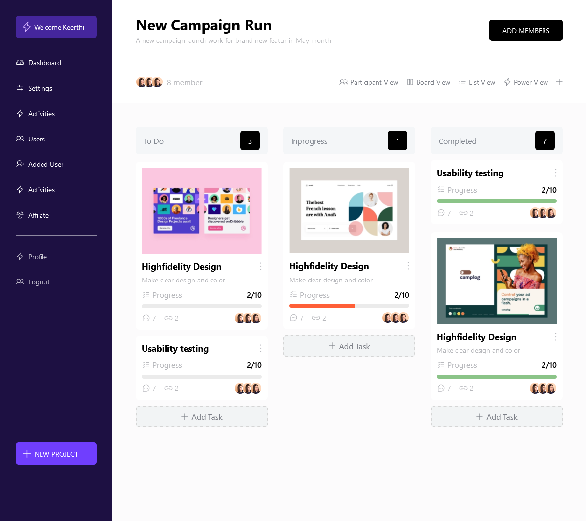

<h1>Introduction</h1>

This is a simple design of a dashboard landing page, which acts as a project management tool in order to keep track for progress of teams. 

<h2>Technologies used</h2>
<ul>
<li>Vite
<ul>
# installation guide for react using vite  
#documentation : https://vitejs.dev/guide/
<li>npm create vite@latest</li>
<li>it would ask you for the project name  just put . to stay in that project folder</li>
# example:npm create vite@latest my-react-app -- --template . 
#a list of options will pop up 
#example
# Reactjs javascript
# Reactjs typescript ...etc
<li>click on javascript</li>
<li>npm install</li>
# to install node modules 
<li>npm run dev</li>
# to kick start your application
</ul>
</li>
<li>React</li>
<li>Tailwind Css
<ul>
<li>Delete App.css from the src folder it will not be needed</li>
<li>you can read the documentation here <a href="https://tailwindcss.com/docs">tailwindcss</a></li>
#To install tailwind css first navigate to frame work on the home page of the documentation.
<li>click on vite</li>
#then navigate to your project folder
#cd myProject 
#then run
<li>npm install -D tailwindcss postcss autoprefixer </li>
<li>npx tailwindcss init -p </li>
#this will generate a post.config.js and a tailwind.config.js file
<li>in your tailwind.config file enter content: [
    "./index.html",
    "./src/**/*.{js,ts,jsx,tsx}",
  ] in the content</li>
  <li>
  in your index.css file located in the src folder delete everything and enter @tailwind base;
@tailwind components;
@tailwind utilities;
  </li>
  #test the code if its working by going to any html element and giving it a className bg-red-600
  <li>npm run dev </li>
</ul>
</li>

</ul>

<h2>folder structure</h2>
<ul>
<ul>
<li>Public </li>
</ul>
<ul>
<li>src</li>
<ul>
<li>assets folder</li>
<li>components folder eg. sidebar
<ul>
<li>Sidebar.jsx</li>
</ul>
</li>
</ul>
<li>App.jsx</li>
<li>index.css</li>
<li>main.jsx</li>
</ul>
<li>index.html</li>
<li>package-lock.json</li>
<li>package.json</li>
<li>postcss.config.js</li>
<li>Readme.MD</li>
<li>tailwind.config.js</li>
<li>vite.config.js</li>
</ul>

<h2>component description</h2>
<ul>
<li> Sidebar.jsx 

This component is found in the sidebar folder which is inside the src folder, It  defines a React component  that represents a sidebar navigation menu for the dashboard. The sidebar contains various menu items with icons and links, and it is styled using Tailwind CSS classes. The Sidebar component is exported as a default export. It is then imported to the App.jsx as a Component. The layout in this component was done using the flex layout

</li>
<li>Navbar.jsx

This component defines a Navbar which contains a header section with a title, a short description, and a button to add members. It also includes a section displaying information about the number of members, as well as various views of the campaign, which are represented by icons.  The component imports various image assets, including icons for the views and user avatars, and uses TailwindCSS classes for styling.It is then exported and imported in the Dashboard Component. The layout in this component was done using the flex layout 

</li>
<li>Description.jsx

This component is found in the description folder which is inside the src folder. It defines the header of several section and the number of task in each section. It is being used in several sections in the website, making it a resusable component. It was exported from the Description.Jsx and imported to the Container.Jsx where it is being used in several places
</li>
<li> Button.jsx

This component is found in the button folder which is inside the src folder. It is a button which was used in several sections in the website, making it a resusable component. It was exported from the Button.Jsx and imported to the Container.Jsx where it is being used in several places

</li>
<li>
Container.jsx

This component is found in the container folder which is inside the src folder. It contains three cards which utilize the <strong>Description</strong> component which was imported from the Description.jsx file. The <strong>Description</strong> component shows the title of each card and the number of tasks in the each section.The cards also contains images, progress bars and also A <strong>Button</strong> component which is a reusable component that is used to ask Add task.In this component I used the flex layout to display each card.This component is then exported and imported in the Dashboard Component

</li>
<li>Dashboard.jsx

This component is found in the dashboard folder which is inside the src folder.This components render the <strong>Navbar</strong> component and the <strong>Container<strong> component. The <strong>Dashboard</strong> is then Exported to the <strong>App.jsx</strong>

</li>
<li>
App.jsx 

This component is located in the src folder. This component contains the <strong>Dashboard</strong> component and the <strong>Sidebar</strong> component in a flex layout  and then exported.

<li>
<li>
Main.jsx

This is where the <strong>App.jsx</strong> is imported to and renderd. the UI design is however being displayed into the <strong>index.html</strong> file from the main.jsx file

</li>
</ul>
 <h2> Difficulties / challenges</h2>
 <ul>
 <li>getting the exact image size for the cards for different screen sizes
 
i battled with getting the exact screen size for different screens in the card 

 <h4>my solution </h4>
 
i downloaded the three images for each screen size, I then put them in a div after which on 1200px i made the two other images hidden on 1440px i made the other 2 images hidden and vise versa

 </li>
 </ul>
<h2>Preview of my work</h2>

